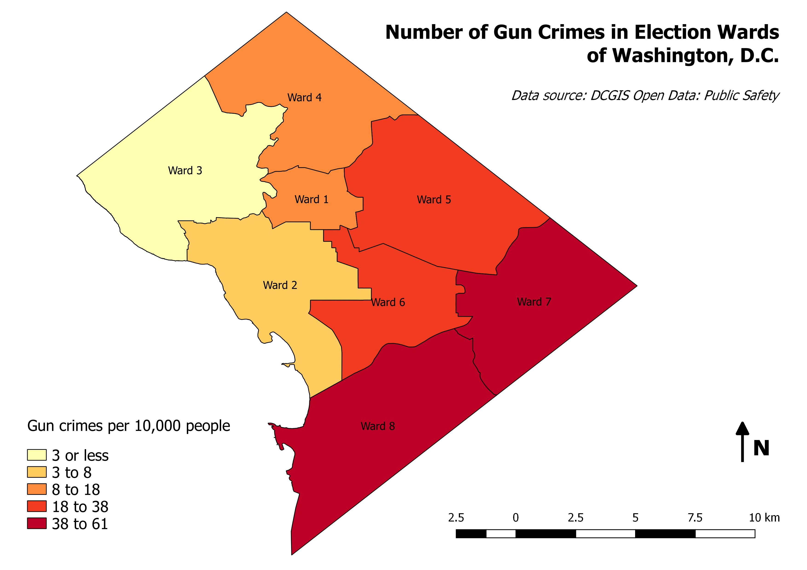
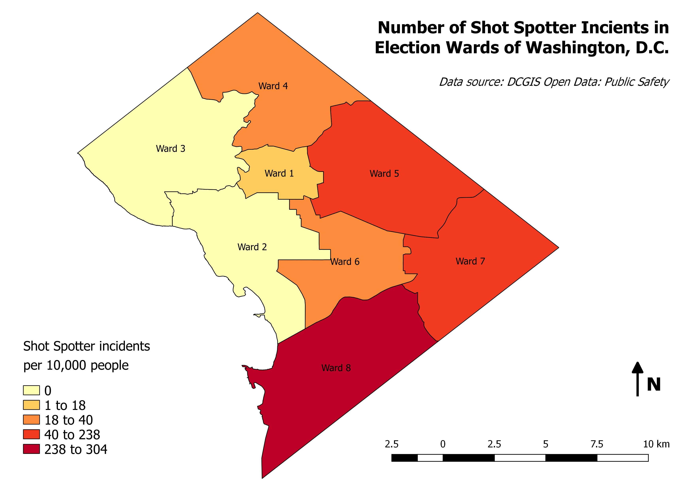

# Recomendations for New Shot Spotter Sensors in Washington D.C. Election Wards

<b>Maddie Guy</b>

<b>4 August 2019</b>

<b>mguy1@umd.edu</b>

<b>Introduction</b>

The code contained and documented here performs an automation of a process to determine what Washington D.C. election wards should install new Shot Spotter sensors in an effort to more effectively record gun shots. This analysis is determined by conducting a geospatial analysis using D.C. gun crime data and Shot Spotter incident data from DCGIS Open Data: Public Safety. Based on the following analysis, it is recommended that more Shot Spotter sensors are installed in Ward 2; while there were only 54 gun crimes reported per in 2017, there were only 2 Shot Spotter incidents, suggesting that there are a gun shots in this ward not captured by the current Shot Spotter sensor network.

<b>Analysis</b>

Data used for this analysis was collected from DCGIS Open Data, an open source repository of GIS data managed by the D.C. government and provided for free and public use. Gun crime point data was downloaded and processed from the 2017 crime incidents dataset. Shot Spotter incident point data for 2017 was downloaded and processed from another dataset that records all Shot Spotter incidents in the sensor network. Election ward polygon data from 2012 was also downloaded from this source. The election ward polygons also contain 2010 population numbers for each ward, which was used in the analysis.

Crime data: https://opendata.dc.gov/datasets/crime-incidents-in-2017

Shot Spotter data: https://opendata.dc.gov/datasets/89bfd2aed9a142249225a638448a5276_29

Election ward data: https://opendata.dc.gov/datasets/ward-from-2012

<i>Figure 1: Number of gun crimes per 10,000 people in D.C.'s election wards</i>

Following a geospatial analysis that joined gun crime incidents and Shot Spotter incidents to each election ward, the count of gun crime incidents per ward was divided by the 2010 population divided by 10,000 to determine the number of gun crime incidents per 10,000 people, as shown in Figure 1. As seen in the figure, most of gun crime incidents occur in the southeast of D.C. (depicted by the darker colors in figure 1).

<i>Figure 2: Number of Shot Spotter gun shots per 10,000 people in D.C.'s election wards</i>

Figure 2 displays number of Shot Spotter incidents per 10,000 people in each ward. The analysis to calculate the incidents was the same as the analysis used to determine gun crimes per 10,000 people, however, the Shot Spotter incident count was used instead of gun crime count. Similar to the pattern seen in Figure 1, Shot Spotter incident reports are mostly focused in the southeast of the region, however, there is a noticeable disconnect between the number of gun crimes and Shot Spotter incidents in Ward 2 when comparing Figure 1 and Figure 2.

<table>
  <tr>
    <th>Ward Name</th>
    <th>Number of gun crimes per 10,000 people</th> 
    <th>Number of Shot Spotter incidents per 10,000 people</th>
  </tr>
  <tr>
    <td>1</td>
    <td>16</td> 
    <td>18</td>
  </tr>
  <tr>
    <td>2</td>
    <td>8</td> 
    <td>0</td>
  </tr>
  <tr>
    <td>3</td>
    <td>3</td> 
    <td>0</td>
  </tr>
  <tr>
    <td>4</td>
    <td>18</td> 
    <td>23</td>
  </tr>
  <tr>
    <td>5</td>
    <td>38</td> 
    <td>60</td>
  </tr>
  <tr>
    <td>6</td>
    <td>23</td> 
    <td>40</td>
  </tr>
  <tr>
    <td>7</td>
    <td>59</td> 
    <td>238</td>
  </tr>
  <tr>
    <td>8</td>
    <td>61</td> 
    <td>304</td>
  </tr>
</table>
<i>Note: gun crime and Shot Spotter incident counts are rounded to the nearest whole number</i>

<b>Automation</b>

<b>Results</b>
